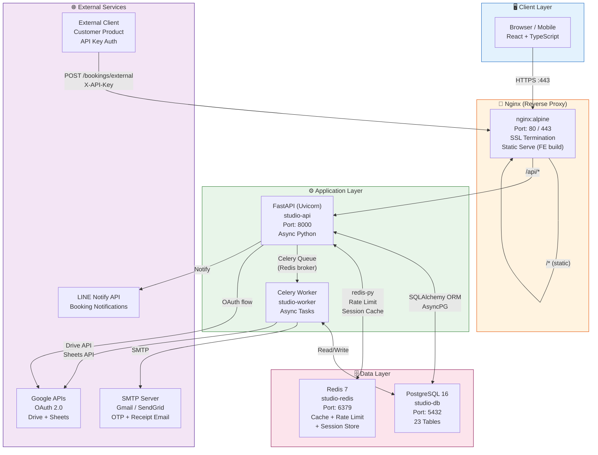
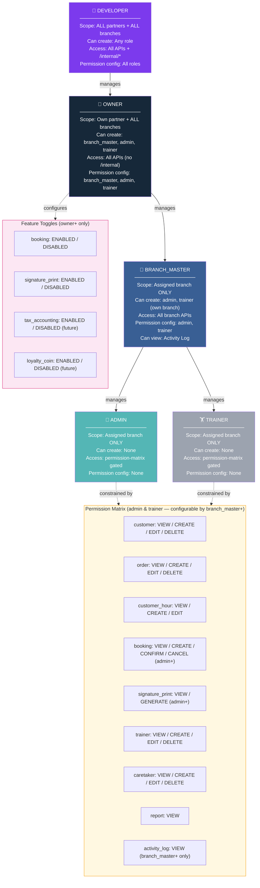
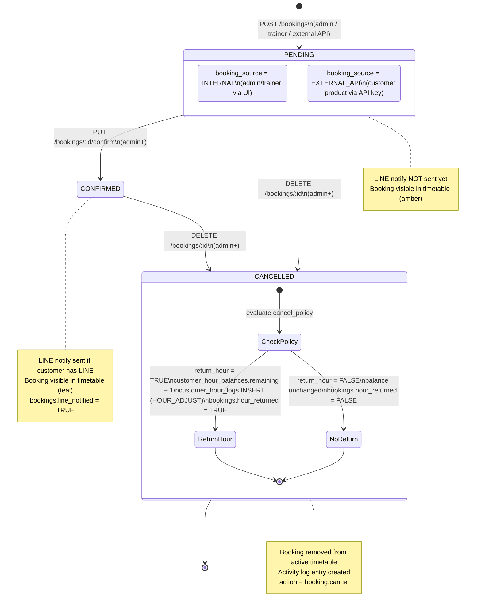
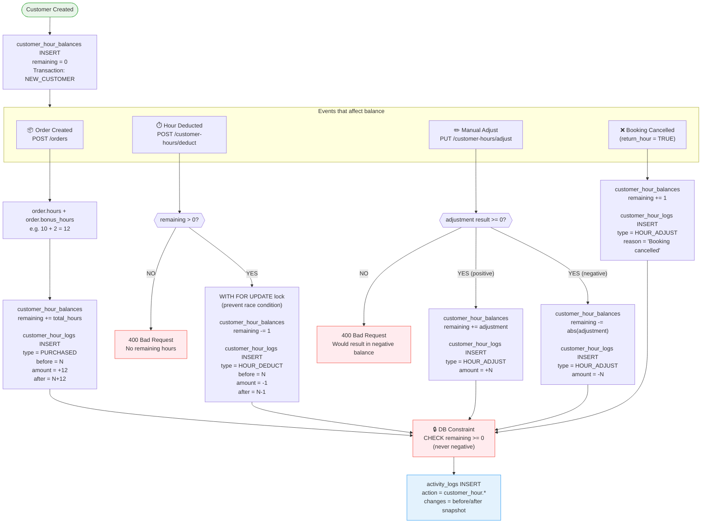
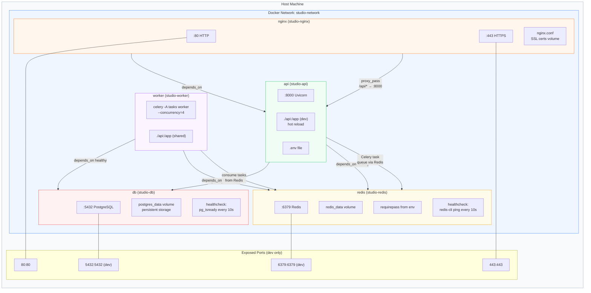
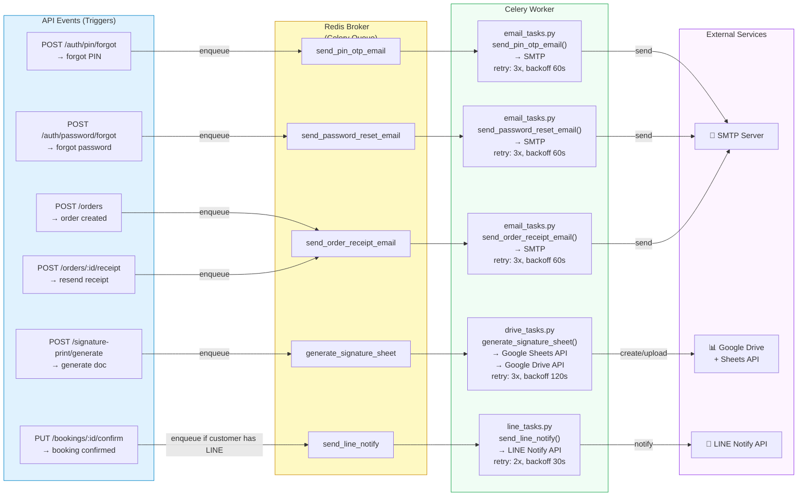
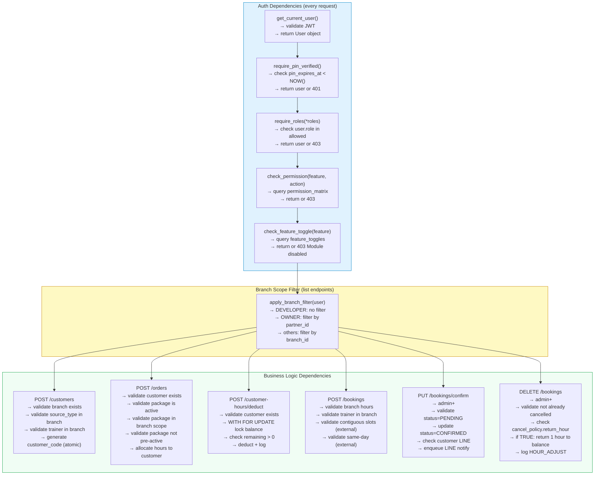

# BE Diagrams — Studio Management
## Version 1.0 | 2026-04-09
### Format: Mermaid (renders on GitHub, GitLab, Obsidian, Notion, VS Code)

---

## 1. ERD — Entity Relationship Diagram

> ทุก table + columns สำคัญ + relationships ครบ 23 tables

```mermaid
erDiagram

    %% ─── CORE ────────────────────────────────────────────────

    partners {
        UUID id PK
        VARCHAR name
        BOOLEAN is_active
        TIMESTAMPTZ created_at
        TIMESTAMPTZ updated_at
    }

    branches {
        UUID id PK
        UUID partner_id FK
        VARCHAR name
        VARCHAR prefix "e.g. BPY"
        TIME opening_time
        TIME closing_time
        BOOLEAN is_active
        TIMESTAMPTZ created_at
        TIMESTAMPTZ updated_at
    }

    source_types {
        UUID id PK
        UUID branch_id FK
        VARCHAR label "e.g. Page"
        VARCHAR code "e.g. MKT"
        BOOLEAN is_active
        TIMESTAMPTZ created_at
    }

    customer_code_counters {
        UUID id PK
        UUID branch_id FK
        UUID source_type_id FK
        INTEGER last_number
    }

    %% ─── AUTH ────────────────────────────────────────────────

    users {
        UUID id PK
        UUID partner_id FK
        UUID branch_id FK "NULL for owner/developer"
        VARCHAR username
        VARCHAR email
        VARCHAR password_hash "bcrypt"
        VARCHAR pin_hash "bcrypt"
        role_enum role "DEVELOPER|OWNER|BRANCH_MASTER|ADMIN|TRAINER"
        BOOLEAN is_active
        BOOLEAN pin_locked
        INTEGER pin_attempts
        TIMESTAMPTZ last_login_at
        TIMESTAMPTZ created_at
        TIMESTAMPTZ updated_at
    }

    login_attempts {
        UUID id PK
        UUID user_id FK "nullable"
        VARCHAR email
        VARCHAR ip_address
        BOOLEAN success
        TIMESTAMPTZ attempted_at
    }

    pin_otp {
        UUID id PK
        UUID user_id FK
        VARCHAR otp_hash
        TIMESTAMPTZ expires_at
        BOOLEAN used
        TIMESTAMPTZ created_at
    }

    password_reset_tokens {
        UUID id PK
        UUID user_id FK
        VARCHAR token_hash
        TIMESTAMPTZ expires_at
        BOOLEAN used
        TIMESTAMPTZ created_at
    }

    user_sessions {
        UUID id PK
        UUID user_id FK
        VARCHAR temporary_token_hash "before PIN"
        VARCHAR access_token_hash "JWT after PIN"
        TIMESTAMPTZ pin_verified_at
        TIMESTAMPTZ pin_expires_at "5h from pin_verified_at"
        TIMESTAMPTZ login_expires_at
        BOOLEAN is_active
        TIMESTAMPTZ created_at
    }

    %% ─── PEOPLE ──────────────────────────────────────────────

    trainers {
        UUID id PK
        UUID branch_id FK
        VARCHAR name
        VARCHAR display_name
        VARCHAR email
        VARCHAR profile_photo_url
        status_enum status "ACTIVE|INACTIVE"
        TIMESTAMPTZ created_at
        TIMESTAMPTZ updated_at
    }

    caretakers {
        UUID id PK
        UUID branch_id FK
        VARCHAR name
        VARCHAR email
        status_enum status "ACTIVE|INACTIVE"
        TIMESTAMPTZ created_at
        TIMESTAMPTZ updated_at
    }

    customers {
        UUID id PK
        UUID partner_id FK
        UUID branch_id FK
        UUID source_type_id FK
        UUID trainer_id FK "assigned trainer"
        UUID caretaker_id FK "assigned caretaker"
        UUID created_by FK
        VARCHAR customer_code "e.g. BPY-MKT001"
        VARCHAR first_name
        VARCHAR last_name
        VARCHAR nickname
        VARCHAR display_name
        contact_channel_enum contact_channel "PHONE|LINE"
        VARCHAR phone
        VARCHAR line_id
        VARCHAR email
        status_enum status "ACTIVE|INACTIVE"
        TEXT notes
        VARCHAR profile_photo_url
        DATE birthday
        BOOLEAN is_duplicate
        TIMESTAMPTZ created_at
        TIMESTAMPTZ updated_at
    }

    %% ─── PACKAGES ────────────────────────────────────────────

    packages {
        UUID id PK
        UUID partner_id FK
        VARCHAR name
        INTEGER hours
        sale_type_enum sale_type "SALE|PRE_SALE"
        NUMERIC price
        branch_scope_enum branch_scope "ALL|SELECTED"
        DATE active_from "NULL=always"
        DATE active_until "NULL=never expires"
        BOOLEAN is_active
        TIMESTAMPTZ created_at
        TIMESTAMPTZ updated_at
    }

    package_branch_scopes {
        UUID id PK
        UUID package_id FK
        UUID branch_id FK
    }

    %% ─── ORDERS ──────────────────────────────────────────────

    orders {
        UUID id PK
        UUID partner_id FK
        UUID branch_id FK
        UUID customer_id FK
        UUID package_id FK
        UUID trainer_id FK
        UUID caretaker_id FK
        UUID created_by FK
        UUID renewed_from_id FK "self-ref"
        DATE order_date
        INTEGER hours
        INTEGER bonus_hours
        INTEGER total_hours "generated: hours+bonus"
        payment_method_enum payment_method "CREDIT|BANK_TRANSFER"
        NUMERIC total_price
        NUMERIC price_per_session
        NUMERIC paid_amount
        NUMERIC outstanding "generated"
        BOOLEAN has_outstanding "generated"
        BOOLEAN is_renewal
        TEXT notes
        TEXT notes2
        TIMESTAMPTZ created_at
        TIMESTAMPTZ updated_at
    }

    order_payments {
        UUID id PK
        UUID order_id FK
        UUID recorded_by FK
        NUMERIC amount
        DATE paid_at
        TEXT note
        TIMESTAMPTZ created_at
    }

    %% ─── CUSTOMER HOURS ──────────────────────────────────────

    customer_hour_balances {
        UUID id PK
        UUID customer_id FK "UNIQUE"
        UUID last_updated_by FK
        INTEGER remaining "CHECK >= 0"
        TIMESTAMPTZ updated_at
    }

    customer_hour_logs {
        UUID id PK
        UUID customer_id FK
        UUID branch_id FK
        UUID trainer_id FK
        UUID user_id FK "who did the action"
        hour_transaction_type_enum transaction_type "PURCHASED|HOUR_DEDUCT|HOUR_ADJUST|NEW_CUSTOMER"
        INTEGER before_amount
        INTEGER amount "positive=add, negative=deduct"
        INTEGER after_amount
        TEXT reason
        TIMESTAMPTZ created_at
    }

    %% ─── BOOKINGS ────────────────────────────────────────────

    bookings {
        UUID id PK
        UUID branch_id FK
        UUID customer_id FK "NULL for staff schedule"
        UUID trainer_id FK
        UUID caretaker_id FK
        UUID confirmed_by FK
        UUID cancelled_by FK
        UUID created_by FK
        booking_type_enum booking_type "CUSTOMER|STAFF_SCHEDULE"
        booking_source_enum booking_source "INTERNAL|EXTERNAL_API"
        TIMESTAMPTZ start_time
        TIMESTAMPTZ end_time
        booking_status_enum status "PENDING|CONFIRMED|CANCELLED"
        BOOLEAN line_notified
        BOOLEAN hour_returned
        TEXT notes
        TIMESTAMPTZ confirmed_at
        TIMESTAMPTZ cancelled_at
        TEXT cancel_reason
        TIMESTAMPTZ created_at
        TIMESTAMPTZ updated_at
    }

    cancel_policies {
        UUID id PK
        UUID branch_id FK "UNIQUE"
        UUID updated_by FK
        INTEGER hours_before "min hours before to cancel"
        BOOLEAN return_hour "return balance on cancel"
        TIMESTAMPTZ updated_at
    }

    %% ─── PERMISSIONS ─────────────────────────────────────────

    permission_matrix {
        UUID id PK
        UUID branch_id FK "NULL=partner-wide"
        UUID updated_by FK
        role_enum role
        VARCHAR feature_name "e.g. customer, order"
        permission_action_enum action "VIEW|CREATE|EDIT|DELETE"
        BOOLEAN is_allowed
        TIMESTAMPTZ updated_at
    }

    feature_toggles {
        UUID id PK
        UUID partner_id FK
        UUID updated_by FK
        VARCHAR feature_name "e.g. booking"
        BOOLEAN is_enabled
        TIMESTAMPTZ updated_at
    }

    %% ─── AUDIT ───────────────────────────────────────────────

    activity_logs {
        UUID id PK
        UUID partner_id FK
        UUID branch_id FK
        UUID user_id FK "who did the action"
        VARCHAR action "e.g. customer.create"
        VARCHAR target_type "e.g. customer"
        UUID target_id
        JSONB changes "before/after snapshot"
        VARCHAR ip_address
        TIMESTAMPTZ created_at
    }

    %% ─── GOOGLE / SETTINGS ───────────────────────────────────

    google_tokens {
        UUID id PK
        UUID user_id FK "UNIQUE"
        VARCHAR connected_email
        TEXT access_token "encrypted"
        TEXT refresh_token "encrypted"
        TIMESTAMPTZ token_expires_at
        TIMESTAMPTZ created_at
        TIMESTAMPTZ updated_at
    }

    signature_print_files {
        UUID id PK
        UUID order_id FK
        UUID generated_by FK
        VARCHAR file_url "Google Sheets link"
        VARCHAR file_id "Google Drive ID"
        TIMESTAMPTZ created_at
    }

    user_preferences {
        UUID id PK
        UUID user_id FK "UNIQUE"
        language_enum language "TH|EN"
        BOOLEAN dark_mode
        TIMESTAMPTZ updated_at
    }

    help_content {
        UUID id PK
        VARCHAR section_key
        VARCHAR title_th
        VARCHAR title_en
        TEXT content_th
        TEXT content_en
        VARCHAR visible_to "roles array"
        INTEGER sort_order
        BOOLEAN is_active
        TIMESTAMPTZ updated_at
    }

    line_qr_codes {
        UUID id PK
        UUID branch_id FK "NULL for developer QR"
        qr_type_enum type "DEVELOPER|BRANCH"
        VARCHAR qr_image_url
        TIMESTAMPTZ updated_at
    }

    %% ─── RELATIONSHIPS ───────────────────────────────────────

    partners ||--o{ branches : "has"
    partners ||--o{ users : "has"
    partners ||--o{ packages : "has"
    partners ||--o{ feature_toggles : "has"

    branches ||--o{ source_types : "has"
    branches ||--o{ customer_code_counters : "has"
    branches ||--o{ users : "assigned to"
    branches ||--o{ trainers : "has"
    branches ||--o{ caretakers : "has"
    branches ||--o{ customers : "belongs to"
    branches ||--o{ orders : "placed in"
    branches ||--o{ bookings : "occurs in"
    branches ||--o{ cancel_policies : "has one"
    branches ||--o{ permission_matrix : "scoped to"
    branches ||--o{ customer_hour_logs : "recorded in"
    branches ||--o{ line_qr_codes : "has"

    source_types ||--o{ customer_code_counters : "counted by"
    source_types ||--o{ customers : "source of"

    users ||--o{ login_attempts : "tracked in"
    users ||--o{ pin_otp : "has"
    users ||--o{ password_reset_tokens : "has"
    users ||--o{ user_sessions : "has"
    users ||--o{ google_tokens : "has one"
    users ||--o{ user_preferences : "has one"

    trainers ||--o{ customers : "assigned to"
    trainers ||--o{ orders : "on"
    trainers ||--o{ bookings : "in"
    trainers ||--o{ customer_hour_logs : "in"

    caretakers ||--o{ customers : "assigned to"
    caretakers ||--o{ orders : "on"
    caretakers ||--o{ bookings : "in"

    customers ||--|| customer_hour_balances : "has one"
    customers ||--o{ customer_hour_logs : "has"
    customers ||--o{ orders : "places"
    customers ||--o{ bookings : "has"

    packages ||--o{ package_branch_scopes : "scoped to"
    packages ||--o{ orders : "used in"

    orders ||--o{ order_payments : "paid via"
    orders ||--o{ signature_print_files : "has"
    orders }o--o| orders : "renewed from"
```

---

## 2. Auth Flow — Sequence Diagram

> ครอบคลุมทุก auth scenario: login, PIN, expiry, forgot PIN, forgot password

```mermaid
sequenceDiagram
    autonumber
    actor User
    participant FE as Frontend
    participant API as FastAPI
    participant DB as PostgreSQL
    participant Redis as Redis
    participant Email as Email Service

    %% ─── NORMAL LOGIN FLOW ───────────────────────────────────
    rect rgb(220, 240, 255)
        Note over User,Email: Normal Login Flow

        User->>FE: Enter email + password
        FE->>API: POST /auth/login
        API->>DB: Find user by email
        DB-->>API: User record
        API->>API: bcrypt verify password
        API->>DB: INSERT login_attempts (success=false/true)
        API->>Redis: Check brute force counter (>10 = 429)

        alt Wrong password (< 10 attempts)
            API-->>FE: 401 Invalid credentials
            FE-->>User: Show error message
        else Too many attempts (>= 10)
            API-->>FE: 429 Too Many Requests
            FE-->>User: "Too many attempts, try later"
        else Valid credentials
            API->>DB: INSERT user_sessions (temporary_token_hash)
            API-->>FE: 200 { temporary_token }
            FE->>FE: Store temporary_token
            FE-->>User: Redirect → /pin page
        end
    end

    %% ─── PIN VERIFY ──────────────────────────────────────────
    rect rgb(220, 255, 220)
        Note over User,Email: PIN Verification → JWT Issued

        User->>FE: Enter 6-digit PIN
        FE->>API: POST /auth/pin/verify (Authorization: Bearer temp_token)
        API->>DB: Find user_session by temporary_token_hash
        API->>DB: Get user.pin_hash
        API->>API: bcrypt verify PIN

        alt Wrong PIN (< 5 attempts)
            API->>DB: UPDATE users SET pin_attempts++
            API-->>FE: 401 Invalid PIN
            FE-->>User: Show error, clear input
        else Too many wrong PINs (>= 5)
            API->>DB: UPDATE users SET pin_locked=true
            API-->>FE: 423 Locked
            FE-->>User: "PIN locked, reset via OTP"
        else Valid PIN
            API->>DB: UPDATE users SET pin_attempts=0
            API->>DB: UPDATE user_sessions SET<br/>access_token_hash, pin_verified_at, pin_expires_at
            API->>API: Generate JWT (signed, contains user_id+role)
            API-->>FE: 200 { access_token, token_type: bearer }
            FE->>FE: Store JWT, clear temporary_token
            FE-->>User: Redirect → /dashboard
        end
    end

    %% ─── PIN SESSION EXPIRY ──────────────────────────────────
    rect rgb(255, 245, 220)
        Note over User,Email: PIN Session Expiry (after 5h)

        User->>FE: Navigate to protected route
        FE->>API: GET /customers (Authorization: Bearer jwt)
        API->>DB: Find user_session by access_token_hash
        API->>API: Check pin_expires_at < NOW()

        alt PIN expired (> 5h)
            API-->>FE: 401 PIN session expired
            FE-->>User: Redirect → /pin (NOT /login)
            Note over FE,User: Login session still valid<br/>Only PIN re-entry required
        else PIN still valid
            API-->>FE: 200 Data
        end
    end

    %% ─── FORGOT PIN / OTP FLOW ───────────────────────────────
    rect rgb(255, 220, 220)
        Note over User,Email: Forgot PIN → OTP Reset

        User->>FE: Click "Forgot PIN?"
        FE->>API: POST /auth/pin/forgot { email }
        API->>Redis: Check OTP rate limit (max 3/60s)

        alt Rate limited
            API-->>FE: 429 Too Many Requests
        else Within limit
            API->>API: Generate 6-digit OTP
            API->>DB: INSERT pin_otp (otp_hash, expires_at=+15min)
            API->>Email: Send OTP email (async via Celery)
            API-->>FE: 200 { message: "OTP sent" }
            FE-->>User: "Check your email"
        end

        User->>FE: Enter OTP + new PIN
        FE->>API: POST /auth/pin/reset { otp, new_pin }
        API->>DB: Find pin_otp by otp_hash where used=false

        alt OTP expired or invalid
            API-->>FE: 400 OTP expired or invalid
        else Valid OTP
            API->>DB: UPDATE pin_otp SET used=true
            API->>DB: UPDATE users SET pin_hash=bcrypt(new_pin), pin_locked=false, pin_attempts=0
            API-->>FE: 200 PIN updated
            FE-->>User: Redirect → /pin (login with new PIN)
        end
    end

    %% ─── FORGOT PASSWORD FLOW ────────────────────────────────
    rect rgb(240, 220, 255)
        Note over User,Email: Forgot Password → Email Reset

        User->>FE: Click "Forgot Password"
        FE->>API: POST /auth/password/forgot { email }
        API->>DB: Find user by email
        Note over API: Always return 200 regardless<br/>(prevent email enumeration)
        API->>API: Generate secure reset token
        API->>DB: INSERT password_reset_tokens (token_hash, expires_at=+15min)
        API->>Email: Send reset link email (async Celery)
        API-->>FE: 200 { message: "If email exists, reset link sent" }

        User->>FE: Click link in email → /reset-password?token=xxx
        FE->>API: POST /auth/password/reset { token, new_password }
        API->>DB: Find password_reset_tokens by token_hash where used=false

        alt Token expired or invalid
            API-->>FE: 400 Token expired or invalid
        else Valid token
            API->>DB: UPDATE password_reset_tokens SET used=true
            API->>DB: UPDATE users SET password_hash=bcrypt(new_password)
            API->>DB: DELETE user_sessions (force re-login everywhere)
            API-->>FE: 200 Password updated
            FE-->>User: Redirect → /login
        end
    end

    %% ─── LOGOUT ──────────────────────────────────────────────
    rect rgb(240, 240, 240)
        Note over User,Email: Logout

        User->>FE: Click Logout
        FE->>API: POST /auth/logout (Authorization: Bearer jwt)
        API->>DB: UPDATE user_sessions SET is_active=false
        API-->>FE: 200 Logged out
        FE->>FE: Clear JWT from storage
        FE-->>User: Redirect → /login
    end
```

---

## 3. System Architecture Diagram

> Services ทั้งหมด + ports + data flow + external integrations

---

## 4. Role & Permission Matrix Diagram

> hierarchy + scope + what each role can configure

---

## 5. Booking State Machine

> ทุก state transition + ใครทำได้ + cancel policy logic

---

## 6. Customer Hour Flow

> ทุก event ที่กระทบ balance + transaction log

---

## 7. Docker Compose Service Map

> ทุก service + port + volume + dependency + network

---

## 8. Celery Task Flow

> ทุก async task + trigger event + retry policy

---

## 9. API Dependency Flow

> ลำดับ dependencies ของแต่ละ endpoint ใช้ตอน implement

---

## Quick Reference — Diagram Index

| # | Diagram | ใช้ตอนไหน |
|---|---------|----------|
| 1 | ERD | Design DB, debug data, onboard dev ใหม่ |
| 2 | Auth Sequence | Implement auth, debug login issues |
| 3 | System Architecture | Setup infra, debug network, deploy |
| 4 | Role & Permission Matrix | Implement guards, debug 403 errors |
| 5 | Booking State Machine | Implement booking flow, cancel logic |
| 6 | Customer Hour Flow | Implement deduct/adjust, debug balance |
| 7 | Docker Compose Map | Setup, debug containers, scale |
| 8 | Celery Task Flow | Implement async tasks, debug email/Drive |
| 9 | API Dependency Flow | Implement endpoints, understand middleware order |
