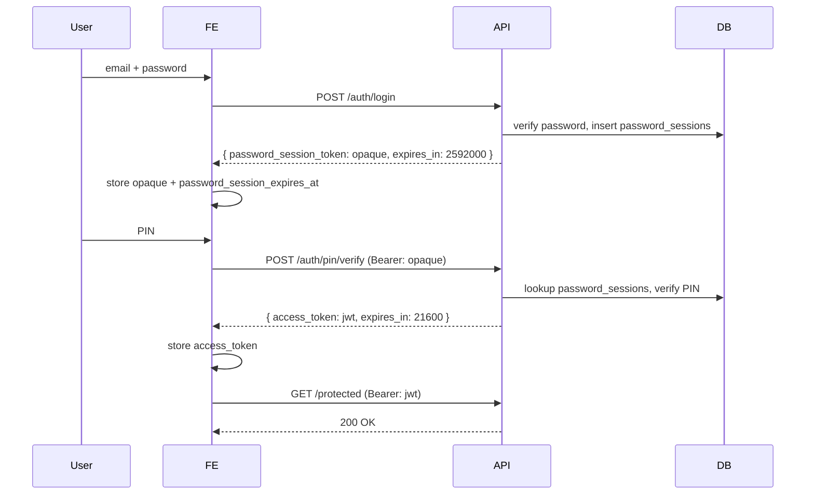
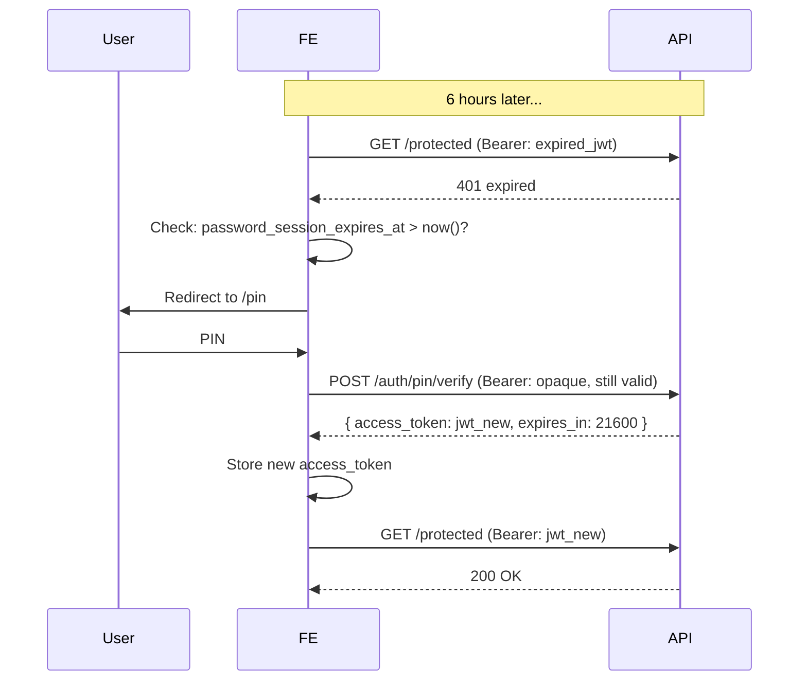
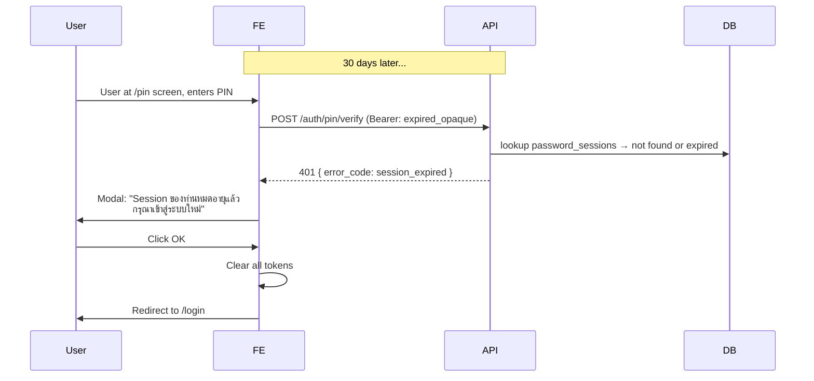

# Auth dual-session design

## Document purpose

This document specifies backend models, API contracts, configuration, frontend behavior, and test/automation updates for **two-layer session lifetimes**:

| Layer                    | Lifetime (requirement) | Purpose                                                                            |
| ------------------------ | ---------------------- | ---------------------------------------------------------------------------------- |
| **Password session**     | **30 days**            | Proves the user knows email + password; user can re-verify PIN without full login. |
| **PIN / access session** | **6 hours**            | Grants access to `pin_verified` protected APIs after successful PIN entry.         |

**Chosen backend approach:** **B — Opaque password session + database** only. There is no JWT-based password session; login returns a random token stored as a hash in `password_sessions`.

**Status:** Design only. Runtime code under `backend/`, `frontend/`, and `tests/` is not changed by this document alone; use the implementation checklist at the end when implementing.

---

## 1. Current state vs target (repository reference)

| Layer                  | Current implementation                                                               | Target (Approach B)                                                             |
| ---------------------- | ------------------------------------------------------------------------------------ | ------------------------------------------------------------------------------- |
| After email + password | Short-lived **JWT** (~5 min), `TEMP_TOKEN_MINUTES` in `backend/api/services/auth.py` | **Opaque token** + row in `**password_sessions`** (30-day `expires_at`)         |
| After PIN verify       | `ACCESS_TOKEN_EXPIRE_MINUTES` default **480** in `backend/api/config.py`             | **Access JWT** only, **6 hours** (360 minutes); `UserSession` unchanged in role |

**BE test fixtures:** `tests/be/conftest.py` builds JWTs via `create_jwt_token(..., pin_verified=True)` directly — bypasses `/auth/login` and `/auth/pin/verify` and does not insert `UserSession`. After implementation, align `expires_delta` with 6h and add fixtures that create `password_sessions` / full HTTP login+PIN where needed.

**Misplaced test file:** `tests/be/test_auth.py` is labeled as FE tests and uses Playwright; treat as technical debt (move under `tests/fe/`, delete duplicate, or replace).

**Doc inconsistency:** `docs/03_be_testcases_V_0_2.md` early TC-API-AUTH-01 still describes `access_token` from `/auth/login`; actual API today returns `temporary_token`. After implementation, reconcile all TC-API-AUTH rows with the contract below (opaque password token from login, JWT only after PIN).

---

## 2. Requirements and definitions

### 2.1 Password session (30 days) — opaque + DB

- Issued only after successful `POST /auth/login`.
- Server generates a **cryptographically random** opaque string (e.g. 32+ bytes, URL-safe); returns it **once** in the API response.
- Stores **only a hash** of that token in `password_sessions` (same idea as `PasswordResetToken.token_hash` — never store the raw token in DB).
- While the row is `is_active` and `expires_at` is in the future, the client may call `POST /auth/pin/verify` with that token to obtain a new **access** JWT without email/password.
- **Revocation:** set `is_active=false` (or delete row) on **logout**, **password change**, **password reset**, `**/internal/invalidate-all-sessions`**, and optionally per-device revoke (future).

### 2.2 PIN / access session (6 hours)

- Issued only after successful `POST /auth/pin/verify` with valid opaque password session + correct PIN.
- **Access JWT** only (`pin_verified=true`, `is_temporary=false`), tracked in `UserSession` by access `jti` as today.
- When access JWT expires, user **re-enters PIN only** if password session is still valid.

### 2.3 Time basis

- Use **UTC** for DB timestamps and JWT `exp`.
- Expose durations via settings/env so CI can shorten lifetimes for tests.

### 2.4 Settings (`Settings` / `.env`)

| Setting                           | Default | Meaning                                                   |
| --------------------------------- | ------- | --------------------------------------------------------- |
| `PASSWORD_SESSION_DAYS`           | `30`    | `expires_at` for new `password_sessions` rows from login. |
| `PIN_ACCESS_TOKEN_EXPIRE_MINUTES` | `360`   | Lifetime of access JWT after PIN (6 hours).               |

Remove `**TEMP_TOKEN_MINUTES`** from login flow once opaque sessions exist. Map post-PIN expiry to `**PIN_ACCESS_TOKEN_EXPIRE_MINUTES**` (or rename from `ACCESS_TOKEN_EXPIRE_MINUTES` explicitly in code).

---

## 3. Backend design (Approach B only)

### 3.1 Login

1. Validate email + password (unchanged).
2. Generate opaque `password_session_token` (raw).
3. `token_hash = hash_password(raw)` or a dedicated HMAC/SHA256 with pepper — **must match verification path** (align with existing `hash_password` / `verify_password` or use `secrets` + bcrypt on raw token string).
4. Insert `password_sessions(user_id, token_hash, expires_at, is_active=True, created_at, …)`.
5. Return `{ "password_session_token": raw }` or keep `**temporary_token`** as the field name for backward compatibility (value is **opaque**, not JWT).

### 3.2 PIN verify

1. Read `Authorization: Bearer <opaque>`.
2. Hash incoming token; lookup `password_sessions` by `token_hash` (or iterate constant-time verify if using bcrypt on token — prefer unique lookup on indexed hash).
3. Reject if missing, `not is_active`, or `expires_at` passed.
4. Verify PIN (unchanged).
5. Issue **access JWT** (6h) + `UserSession` row for access `jti` (unchanged pattern).
6. Optional policy: **rotate** password session (invalidate old row, issue new opaque) — not required for v1; document if single-use pin/verify is desired later.

### 3.3 Why B only

- **Immediate server-side revoke** for logout and password change without waiting for JWT expiry.
- **Clear separation:** opaque string never contains claims; access JWT remains short-lived and stateless aside from `UserSession` invalidation.

**Trade-off:** Every `POST /auth/pin/verify` does a **DB read** (and possibly write). Mitigate with index on `token_hash` (unique).

---

## 4. JWT claims (access token only)

Password session is **not** a JWT. Only the post-PIN **access** token uses JWT:

- `sub`, `role`, `partner_id`, `branch_id`
- `pin_verified`: `true`
- `is_temporary`: `false`
- `jti`, `exp` (~6 hours from issue)

Created via existing `create_jwt_token` (or equivalent) with `PIN_ACCESS_TOKEN_EXPIRE_MINUTES`.

---

## 5. API contract

### 5.1 `POST /auth/login`

- **Request:** `{ "email", "password" }` (unchanged).
- **Response (200):** `{ "temporary_token": "<opaque>" }` and/or `{ "password_session_token": "<opaque>" }` — pick one canonical field in OpenAPI; if two, document deprecation timeline.
- **Response (optional):** `expires_in` (seconds until password session expiry) for UX without client-side JWT decode.
- **Errors:** Unchanged (401, 429).

### 5.2 `POST /auth/pin/verify`

- **Headers:** `Authorization: Bearer <opaque_password_session_token>`.
- **Body:** `{ "pin": "..." }`.
- **Response (200):** `{ "access_token": "<jwt>", "token_type": "bearer", "expires_in": <seconds> }`.
- **Errors:** See error case matrix below.

#### 5.2.1 Error responses

| Scenario                                          | Status | `error_code`      | `detail`                                  | FE behavior                                                          |
| ------------------------------------------------- | ------ | ----------------- | ----------------------------------------- | -------------------------------------------------------------------- |
| Wrong PIN (account not locked)                    | 401    | `invalid_pin`     | `"Invalid PIN"`                           | Show inline error, stay at `/pin`                                    |
| PIN correct but password session expired          | 401    | `session_expired` | `"Session expired. Please log in again."` | Show modal "Session ของท่านหมดอายุ\nกรุณาเข้าสู่ระบบใหม่" → `/login` |
| PIN correct but password session revoked/inactive | 401    | `session_revoked` | `"Session revoked. Please log in again."` | Show modal → `/login`                                                |
| Malformed/missing Bearer token                    | 401    | `invalid_token`   | `"Invalid or missing token"`              | Redirect to `/login`                                                 |
| Account locked (5+ wrong PINs)                    | 423    | `account_locked`  | `"Account locked. Contact support."`      | Show error message, offer unlock option                              |

**Implementation note:** Use `error_code` field (not just `detail` string) so frontend can reliably distinguish error types without parsing strings.

### 5.3 Protected routes (`require_pin_verified`)

- **Only** accept **access JWT** (`Authorization: Bearer <jwt>`).
- **Do not** accept opaque password token on these routes — if client sends opaque token, return 401 (“PIN verification required” or “Invalid token type”).

### 5.4 `GET /auth/me`

- Access JWT only (unchanged).

### 5.5 `POST /auth/logout`

- **Headers:** `Authorization: Bearer <access_jwt>`.
- **Body (optional):** `{ "password_session_token": "<opaque>" }` (only needed for single-device logout; omit for full sign-out).
- **Response (200):** `{ "message": "Logged out successfully" }`.

#### Logout behavior

1. **Full sign-out (recommended):** If no `password_session_token` in body:
  - Revoke current access `UserSession` by `jti` (set `is_active=false`).
  - Revoke **all** `password_sessions` for `user_id` (set `is_active=false`).
  - User must log in again from scratch.
2. **Single-device logout (future):** If `password_session_token` provided:
  - Revoke current access `UserSession` by `jti`.
  - Revoke **only** that specific `password_sessions` row by hash lookup.
  - If user has other active password sessions, they can still use those devices without re-logging in.

For v1, implement **full sign-out** (option 1 only) — simpler and more secure.

### 5.6 `POST /auth/password/change`

- **Headers:** `Authorization: Bearer <access_jwt>`.
- **Body:** `{ "current_password": "...", "new_password": "..." }`.
- **Response (200):** `{ "message": "Password changed successfully" }`.
- **Side effects:**
  - Invalidate **all** `UserSession` rows for user (revoke all access JWTs).
  - Set **all** `password_sessions` for user to `is_active=false` (user must log in again on all devices).

### 5.7 `POST /auth/password/reset` (via email token)

- **Headers:** None (unauthenticated).
- **Body:** `{ "token": "reset_token", "new_password": "..." }`.
- **Response (200):** `{ "message": "Password reset successfully" }`.
- **Side effects:**
  - Invalidate **all** `UserSession` rows for user.
  - Set **all** `password_sessions` for user to `is_active=false`.

### 5.8 `POST /internal/invalidate-all-sessions` (admin/developer only)

- **Headers:** `X-API-Key: <developer_api_key>` (no Bearer token).
- **Body:** `{ "user_id": "<uuid>" }` (invalidate specific user) or `{}` (global invalidate for all users — use with caution).
- **Response (200):** `{ "message": "All sessions invalidated" }`.
- **Side effects:**
  - Set **all** `password_sessions.is_active=false` for target user(s).
  - Revoke **all** `UserSession` rows for target user(s).

---

## 6. Model / database

### 6.1 `password_sessions` (new)

| Column       | Type                    | Notes                            |
| ------------ | ----------------------- | -------------------------------- |
| `id`         | UUID PK                 |                                  |
| `user_id`    | UUID FK → users         |                                  |
| `token_hash` | string, unique, indexed | Hash of opaque token             |
| `expires_at` | datetime                | UTC, now + PASSWORD_SESSION_DAYS |
| `is_active`  | bool                    | default true                     |
| `created_at` | datetime                |                                  |

Optional: `user_agent`, `ip_address`, `last_used_at` for audit (future).

**Migration:** Alembic; no backfill for greenfield.

### 6.2 `UserSession` (`backend/api/models/user.py`)

- Unchanged purpose: **access** JWT after PIN (`token_jti`, `expires_at`, `is_active`, `user_id`, `email`, …).
- `expires_at` aligns with **6-hour** access JWT.

---

## 7. Dependencies and security (`get_current_user`)

File: `backend/api/dependencies/auth.py`.

- **Access path:** `Authorization` is **JWT** → decode, verify signature/`exp`, check `pin_verified`, check `UserSession` for revoked access `jti`.
- **Do not** treat opaque strings as JWT on protected routes — failed JWT decode → 401.
- Dedicated helper for **pin/verify route only:** parse Bearer token, resolve `password_sessions` by hash, attach user context for PIN step.

**Security:** Opaque token in browser storage is still **XSS-stealable**; mitigate with CSP, HTTPS. httpOnly cookie for password session is a possible future improvement (separate cookie contract).

---

## 8. Frontend (when implemented)

### 8.1 Session storage

- Persist **opaque `password_session_token`** (from login) and `**access_token**` (JWT from PIN) separately in localStorage or sessionStorage.
- Store `**password_session_expires_at**` (ISO timestamp) from login `expires_in` calculation: `Date.now() + (expires_in * 1000)`.
- **No JWT `exp` on password session** — use `expires_in` from login response or call a lightweight “session status” endpoint later if needed.

### 8.2 API calls

- API client: send **access JWT** (`Authorization: Bearer <access_token>`) on protected calls.
- **Never** send opaque password token to protected routes — 401 if attempted.

### 8.3 Token expiry handling

#### On 401 from protected API call (expired access JWT)

1. Check if opaque password_session_token exists in storage.
2. IF exists AND `password_session_expires_at > now()`:
  - **Redirect to `/pin`** (user must re-enter PIN to get new access token).
3. ELSE:
  - Clear all tokens from storage.
  - **Redirect to `/login`** (user must log in again).

#### On 401 from `POST /auth/pin/verify`

1. Parse response body `error_code` field (or detail string as fallback).
2. IF `error_code === “invalid_pin”`:
  - Show inline error: `”PIN ไม่ถูกต้อง”`
  - Stay at `/pin` page.
  - Do NOT clear tokens.
3. IF `error_code === “session_expired”` OR `error_code === “session_revoked”`:
  - Show modal dialog:
  - Clear all tokens from storage.
  - Redirect to `/login` after user clicks OK.
4. IF status `=== 423` (account locked):
  - Show error message with unlock/support option.
  - Stay at `/pin`.

### 8.4 Cleanup

- Remove test hacks like `sessionStorage.setItem('pin_expired', 'true')` — use real expiry timings or short test TTLs instead.

### 8.5 Sequence diagrams (Approach B)

#### Normal flow: login → PIN → access

#### After 6h: access JWT expires, re-enter PIN (no new login needed)

#### After 30 days: password session expires while user at PIN screen

---

## 9. Backend test plan (`tests/be/test_auth_api.py` and friends)

### Test cases to add/update

1. **Login:**
  - Response contains `{ "password_session_token": "<opaque>", "expires_in": 2592000 }` (string, not three JWT parts).
  - Assert row in `password_sessions` with `expires_at` ~30 days in future, `is_active=true`.
2. **PIN verify with valid password session:**
  - Response contains `{ "access_token": "<jwt>", "expires_in": 21600 }`.
  - Decode JWT; assert `exp` is ~6 hours from now, `pin_verified=true`, `is_temporary=false`.
  - Assert row in `UserSession` created with `expires_at` ~6 hours.
3. **Re-enter PIN (after 6h access expiry, before 30d password expiry):**
  - Use same opaque token + PIN → `POST /auth/pin/verify` returns new access JWT.
  - Old `UserSession` should be revoked (`is_active=false`) or new one created.
4. **Expired password session:**
  - Manually set password_sessions row `expires_at` to past → `/auth/pin/verify` with opaque returns 401 with `error_code: session_expired`.
5. **Wrong PIN:**
  - `/auth/pin/verify` with wrong PIN returns 401 with `error_code: invalid_pin` (not `session_expired`).
6. **Protected route rejects opaque token:**
  - `GET /auth/me` with `Authorization: Bearer <opaque_password_session_token>` returns 401 (token is not a JWT).
7. **Logout invalidates password session:**
  - Call `POST /auth/logout` with access JWT.
  - Verify: opaque token no longer works for `/auth/pin/verify` (401 `session_revoked`).
  - Verify: all `UserSession` rows for user `is_active=false`.
8. **Password change invalidates all sessions:**
  - Change password via `POST /auth/password/change`.
  - Verify: all `password_sessions` for user `is_active=false`.
  - Verify: all `UserSession` for user `is_active=false`.
9. `**invalidate-all-sessions` endpoint:**
  - Call with developer API key + `user_id`.
  - Verify: all `password_sessions` for that user `is_active=false`.
  - Verify: all `UserSession` for that user `is_active=false`.
10. **Account lockout still works:**
  - After 5 wrong PINs, account locked → `/auth/pin/verify` returns 423 `account_locked` (not 401 `invalid_pin`).

### `conftest.py` fixtures

- `**password_session_via_login`:** Call `POST /auth/login`, extract opaque token and calculate `expires_at`. Return dict with token + metadata.
- `**full_auth_via_api`:** Runs login + PIN verify; returns `(password_session_token, access_token)` tuple and stores rows in DB.
- `**auth_token` (existing):** Remains JWT-only for speed for non-auth tests; set `expires_delta=timedelta(hours=6)` to match new 6h access expiry.

### Documentation sync

- Update `docs/03_be_testcases_V_0_2.md`: all TC-API-AUTH-* rows must reflect opaque login response and 6h PIN JWT (not TEMP_TOKEN).
- Update `docs/05_be_design.md`: add subsection on dual-session model (if exists).
- Ensure `docs/07_be_diagrams.md` (if exists) shows password_sessions table and 6h/30d lifetimes.

---

## 10. Frontend / Playwright test plan

Files: `tests/fe/test_auth.py`, `tests/fe/helpers/common_web.py`.

### Test cases

1. **Login flow:**
  - Email + password → receive `password_session_token` (opaque, not JWT-shaped).
  - Store token + calculate `password_session_expires_at`.
  - Assert: can navigate to `/pin`.
2. **PIN entry flow:**
  - Enter correct PIN → receive `access_token` (JWT) + `expires_in`.
  - Store both tokens.
  - Assert: redirected to dashboard.
3. **Protected route with valid tokens:**
  - Access dashboard → 200 OK.
4. **Access JWT expires, PIN session still valid:**
  - Manually expire access JWT in sessionStorage (set expiry to past).
  - Try to access protected route → should redirect to `/pin` (not `/login`).
  - Enter PIN again → get new JWT, dashboard loads.
5. **Password session expires during PIN entry:**
  - Manually expire password_session_expires_at in storage.
  - User at `/pin` screen → submits PIN.
  - API returns 401 `session_expired`.
  - Assert: modal "Session ของท่านหมดอายุแล้ว" shows.
  - User clicks OK → redirect `/login`.
6. **Wrong PIN at `/pin`:**
  - Submit wrong PIN → API returns 401 `invalid_pin`.
  - Assert: inline error shows, user stays at `/pin`, tokens NOT cleared.
7. **Logout:**
  - Click logout button → both tokens cleared, redirect `/login`.
8. **Password change:**
  - Change password from settings → all tokens cleared, redirect `/login` with message "Password changed".

### Implementation notes

- Replace `sessionStorage.setItem('pin_expired', 'true')` hacks with real token storage.
- Use `password_session_expires_at` as source of truth (not JWT decode — opaque has no JWT structure).
- On API 401 responses: distinguish `error_code` (not just detail string).
- Test short TTL: Set `PASSWORD_SESSION_DAYS=0.01` and `PIN_ACCESS_TOKEN_EXPIRE_MINUTES=1` in test `.env` for fast expiry tests (optional).
- Docstrings: clarify **6 hours** for access JWT (not 5h, not 8h).

---

## 11. Documentation updates (when implementing)

| File | Section | Change |
|------|---------|--------|
| `docs/03_be_testcases_V_0_2.md` | TC-API-AUTH-01 to 30 | Update all TC rows: opaque login token, 6h access JWT, error_code response fields |
| `docs/04_integration_testcases_V_0_2.md` | TC-INT-AUTH-02 | Full login→PIN→access flow with assertions on opaque + JWT |
| `docs/05_be_design.md` | New subsection | Session model: Approach B (opaque + DB-backed password sessions) |
| `docs/06_automation_test_plan.md` | BE test fixtures | Opaque login response, full_auth_via_api fixture, error_code assertions |
| `docs/07_be_diagrams.md` | ER diagram | Add `password_sessions` table; auth sequence: login→opaque, pin/verify→JWT |

---

## 12. Implementation checklist (post-approval)

### Backend code changes

- [x] `backend/api/config.py` ✅ 2026-04-14
  - Add `PASSWORD_SESSION_DAYS: int = 30`
  - Add `PIN_ACCESS_TOKEN_EXPIRE_MINUTES: int = 360`
  - Remove or deprecate `TEMP_TOKEN_MINUTES`
  
- [x] `backend/api/models/user.py` ✅ 2026-04-14
  - Create `PasswordSession` model with columns: `id`, `user_id` (FK), `token_hash`, `expires_at`, `is_active`, `created_at`
  - Add index on `token_hash` (unique)
  
- [x] `backend/api/migrations/versions/c01ad1b96c63_add_password_sessions_table.py` ✅ 2026-04-14
  - Create table `password_sessions` with above columns
  
- [x] `backend/api/services/auth.py` ✅ 2026-04-14
  - Update `login()`: Generate opaque token, hash it, insert into `password_sessions`, return `{ "password_session_token": raw_token, "expires_in": 2592000 }`
  - Update `pin_verify()`: Accept opaque Bearer, hash it (SHA-256), lookup in `password_sessions`, verify not expired/revoked, issue 6h access JWT
  - Add error handling: return `error_code: "invalid_pin" | "session_expired" | "session_revoked"` (not just detail string)
  - Update `logout()`: Set `password_sessions.is_active=false` for all user rows + revoke current `UserSession`
  - Update `change_password()` and `reset_password()`: Set all `password_sessions.is_active=false` + revoke all `UserSession` for user
  
- [x] `backend/api/dependencies/auth.py` ✅ 2026-04-14
  - Update `get_current_user()`: Accept **JWT only** on protected routes, reject opaque tokens with 401 `invalid_token`
  - Add `verify_password_session()` helper: SHA-256 hash incoming opaque, lookup `password_sessions`, check expiry/active status
  
- [x] `backend/api/routers/auth.py` ✅ 2026-04-14
  - Update `/auth/login` response structure: `{ "password_session_token": "...", "expires_in": 2592000 }`
  - Update `/auth/pin/verify` response: `{ "access_token": "...", "expires_in": 21600, "token_type": "bearer" }`
  - Update `/auth/logout` (full sign-out)
  - Update OpenAPI docstrings for error_code responses
  
- [x] Remove JWT issuance from login code ✅ 2026-04-14
  - Login calls `create_jwt_token()` no more
  - PIN verify calls it with `pin_verified=true, expires_delta=timedelta(minutes=360)`

### Test code changes

- [x] `tests/be/conftest.py` ✅ 2026-04-14
  - Added `password_session_via_login()` fixture: calls login, returns `{ "token": opaque, "expires_at": datetime }`
  - Added `full_auth_via_api()` fixture: login + PIN verify, returns `(password_token, access_jwt)`
  
- [x] `tests/be/test_auth_api.py` ✅ 2026-04-14 — 204/204 BE tests passing
  - Added 10 test cases (TC-API-AUTH-DS-01 to DS-10): login opaque, PIN verify 6h JWT, expired session, wrong PIN, logout revocation, etc.
  - All assertions check `error_code` field in 401 responses
  
- [x] `tests/fe/test_auth.py` ✅ 2026-04-15
  - Rewrote with 10 test cases: TC-AUTH-01 to TC-AUTH-06 + TC-FE-DS-01 to DS-07
  - Replaced `sessionStorage.setItem('pin_expired', 'true')` hack with real localStorage manipulation
  - Added dual-session assertions (opaque vs JWT shape, token persistence, modal text)
  - Added `mock_api_response` for session_expired/revoked scenarios
  
- [x] `tests/fe/helpers/common_web.py` ✅ 2026-04-15
  - Added `get_local_storage()`, `expire_access_token()`, `expire_password_session()`
  - Added `is_jwt_shaped()`, `assert_session_expired_modal_visible()`, `click_session_expired_confirm()`
  - Added `assert_tokens_cleared()`

### Documentation changes

- [ ] `docs/03_be_testcases_V_0_2.md` — Reconcile all TC-API-AUTH rows with new contract
- [ ] `docs/04_integration_testcases_V_0_2.md` — Add TC-INT-AUTH-02 for full login→PIN→access
- [ ] `docs/05_be_design.md` — Add session model subsection
- [ ] `docs/06_automation_test_plan.md` — Add fixtures + error response handling
- [ ] `docs/07_be_diagrams.md` — Add ER diagram for `password_sessions`, update auth sequence diagram

### Optional future work (post-v1)

- [ ] Single-device logout via `password_session_token` in `/auth/logout` body
- [ ] Per-device session tracking (user_agent, ip_address in `password_sessions`)
- [ ] Session status endpoint (GET) to check expiry without calling protected route

---

## 13. Security considerations

### 13.1 Opaque token storage

- Opaque password session token is still **susceptible to XSS** if stored in localStorage/sessionStorage.
- **Mitigations:**
  - Content Security Policy (CSP) headers — prevent inline script injection.
  - HTTPS only — prevent MITM interception.
  - httpOnly cookies (future v2) — JavaScript cannot access; mitigates XSS exposure.
  - Token rotation on password change — existing token no longer valid if password compromised.

### 13.2 Token hashing in database

- Always store **hash** of opaque token, never raw value.
- Use `hash_password()` (bcrypt) or dedicated HMAC-SHA256 with pepper.
- Lookup must be constant-time or indexed to prevent timing attacks.

### 13.3 Rate limiting

- Existing login brute force protection (10 failed attempts → 429) applies to password session creation.
- PIN verify rate limiting applies to access token refresh (locked account after 5 failed PINs).
- Optional future: Rate limit password session creations per user per IP (prevent distributed attacks).

---

## 14. Backward compatibility & migration note

### Field naming

- Field **`temporary_token`** from login response **becomes opaque string** (not JWT-shaped).
- Clients that perform JWT parsing on login response will fail → **breaking change**.
- **Options:**
  - Dual-field during transition: return both `temporary_token` (deprecated) and `password_session_token` (new).
  - Update clients first, then deploy backend.
  - Document in changelog and API documentation.

### Recommended for v1

- Use **`password_session_token`** as canonical field name.
- Do NOT use `temporary_token` field (avoid confusion with old JWT-based approach).

---

## 15. Version & approval

| Version | Date       | Notes |
|---------|------------|-------|
| 0.1     | 2026-04-12 | Initial design (A/B options). |
| 0.2     | 2026-04-12 | **Approach B only** — opaque + DB. |
| **0.3** | **2026-04-14** | **Refined B:** error_code responses, 3-scenario frontend modal, detailed test plan, implementation checklist. |

**Implementation status:**
- [x] Design reviewed and approved
- [x] Frontend modal UX implemented (section 8.3) — SessionExpiredModal.tsx ✅
- [x] Backend fully implemented — 204/204 BE tests passing ✅
- [ ] Test env configured with short TTLs (optional; use mock_api_response for FE tests)
- [x] FE components have data-testid attributes ✅ 2026-04-15
- [x] ProtectedRoute guard added to App.tsx ✅ 2026-04-15
- [x] FE Playwright tests written (TC-FE-DS-01 to DS-07) ✅ 2026-04-15

**Next step:** Run FE Playwright tests (`pytest tests/fe/test_auth.py`) → fix failures → Step 16 complete.

