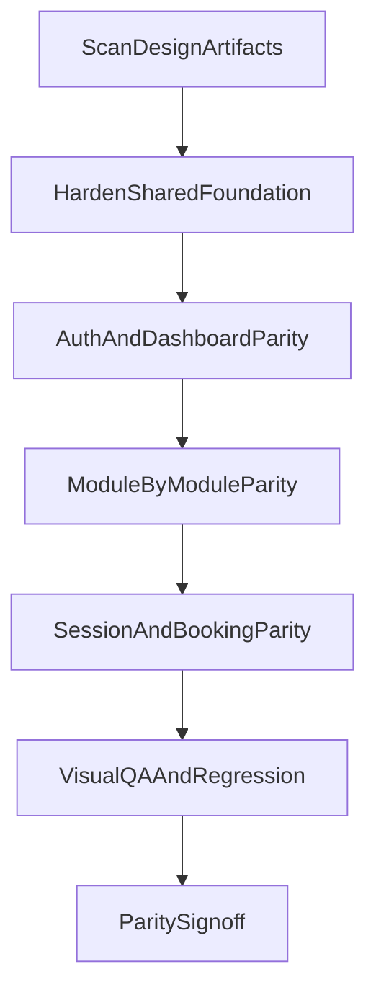

# FE Design Parity Plan (Desktop-First, Pixel-Perfect)

## Goal
Bring all implemented FE screens to pixel-perfect parity with the FE design artifacts in [docs/FE Design](docs/FE Design), using a shared design-system-first rollout so changes stay consistent and maintainable.

## Inputs Scanned
- Design source folders: all 18 under [docs/FE Design](docs/FE Design)
- Current FE routes and pages: [frontend/src/App.tsx](frontend/src/App.tsx), [frontend/src/pages](frontend/src/pages)
- Shared shell and styling foundation: [frontend/src/components/layout](frontend/src/components/layout), [frontend/tailwind.config.ts](frontend/tailwind.config.ts), [frontend/src/styles/globals.css](frontend/src/styles/globals.css)

## Design Artifact Mapping (Full)
| Design folder | HTML spec | Visual reference | FE route(s) | FE implementation file(s) | Status | Owner | Notes |
|---|---|---|---|---|---|---|---|
| `add_edit_package_form` | [code.html](docs/FE%20Design/add_edit_package_form/code.html) | [screen.png](docs/FE%20Design/add_edit_package_form/screen.png) | `/packages/new`, `/packages/:id/edit` | [frontend/src/pages/packages/PackageForm.tsx](frontend/src/pages/packages/PackageForm.tsx) | Not started | FE | Form layout and field grouping parity |
| `azure_studio_pro` | [DESIGN.md](docs/FE%20Design/azure_studio_pro/DESIGN.md) | N/A | Global | [frontend/tailwind.config.ts](frontend/tailwind.config.ts), [frontend/src/styles/globals.css](frontend/src/styles/globals.css) | In progress | FE | Master desktop-first design system |
| `consultant_directory` | [code.html](docs/FE%20Design/consultant_directory/code.html) | [screen.png](docs/FE%20Design/consultant_directory/screen.png) | `/caretakers` (current closest) | [frontend/src/pages/caretakers/CaretakerList.tsx](frontend/src/pages/caretakers/CaretakerList.tsx) | Not started | FE+PM | Confirm if dedicated `/consultants` route is required |
| `customer_session_focused_table_view` | [code.html](docs/FE%20Design/customer_session_focused_table_view/code.html) | [screen.png](docs/FE%20Design/customer_session_focused_table_view/screen.png) | `/sessions/log` | [frontend/src/pages/sessions/SessionLog.tsx](frontend/src/pages/sessions/SessionLog.tsx) | Not started | FE | Table density, filters, row rhythm |
| `customer_session_management_hours_view` | [code.html](docs/FE%20Design/customer_session_management_hours_view/code.html) | [screen.png](docs/FE%20Design/customer_session_management_hours_view/screen.png) | `/sessions/deduct`, `/sessions/trainer-report` | [frontend/src/pages/sessions/SessionDeduct.tsx](frontend/src/pages/sessions/SessionDeduct.tsx), [frontend/src/pages/sessions/TrainerReport.tsx](frontend/src/pages/sessions/TrainerReport.tsx) | Not started | FE | Hours cards + actions layout |
| `login_screen` | [code.html](docs/FE%20Design/login_screen/code.html) | [screen.png](docs/FE%20Design/login_screen/screen.png) | `/login` | [frontend/src/pages/Login.tsx](frontend/src/pages/Login.tsx) | Not started | FE | Two-panel editorial layout required |
| `mindful_azure_mobile` | [DESIGN.md](docs/FE%20Design/mindful_azure_mobile/DESIGN.md) | N/A | Future mobile phase | TBD | Deferred | FE | Out of current desktop-first scope |
| `package_management_list_view` | [code.html](docs/FE%20Design/package_management_list_view/code.html) | [screen.png](docs/FE%20Design/package_management_list_view/screen.png) | `/packages` | [frontend/src/pages/packages/PackageList.tsx](frontend/src/pages/packages/PackageList.tsx) | Not started | FE | Table/list parity + actions bar |
| `simplified_order_management` | [code.html](docs/FE%20Design/simplified_order_management/code.html) | [screen.png](docs/FE%20Design/simplified_order_management/screen.png) | `/orders`, `/orders/new`, `/orders/:id`, `/orders/:id/edit` | [frontend/src/pages/orders/OrderList.tsx](frontend/src/pages/orders/OrderList.tsx), [frontend/src/pages/orders/OrderForm.tsx](frontend/src/pages/orders/OrderForm.tsx), [frontend/src/pages/orders/OrderDetail.tsx](frontend/src/pages/orders/OrderDetail.tsx) | Not started | FE | Simplified management flow parity |
| `streamlined_admin_dashboard` | [code.html](docs/FE%20Design/streamlined_admin_dashboard/code.html) | [screen.png](docs/FE%20Design/streamlined_admin_dashboard/screen.png) | `/dashboard` | [frontend/src/pages/Dashboard.tsx](frontend/src/pages/Dashboard.tsx), [frontend/src/components/dashboard/StatCard.tsx](frontend/src/components/dashboard/StatCard.tsx) | Not started | FE | Hero + MTD + cards + booking section |
| `trainer_directory_table_view` | [code.html](docs/FE%20Design/trainer_directory_table_view/code.html) | [screen.png](docs/FE%20Design/trainer_directory_table_view/screen.png) | `/trainers` | [frontend/src/pages/trainers/TrainerList.tsx](frontend/src/pages/trainers/TrainerList.tsx) | Not started | FE | Table alignment and row actions |
| `updated_add_new_customer_form_navigation` | [code.html](docs/FE%20Design/updated_add_new_customer_form_navigation/code.html) | [screen.png](docs/FE%20Design/updated_add_new_customer_form_navigation/screen.png) | `/customers/new`, `/customers/:id/edit` | [frontend/src/pages/customers/CustomerForm.tsx](frontend/src/pages/customers/CustomerForm.tsx) | Not started | FE | Multi-section form navigation parity |
| `updated_branch_configuration` | [code.html](docs/FE%20Design/updated_branch_configuration/code.html) | [screen.png](docs/FE%20Design/updated_branch_configuration/screen.png) | `/settings/branches` | [frontend/src/pages/settings/BranchConfig.tsx](frontend/src/pages/settings/BranchConfig.tsx) | Not started | FE | Config card hierarchy + controls |
| `updated_customer_management` | [code.html](docs/FE%20Design/updated_customer_management/code.html) | [screen.png](docs/FE%20Design/updated_customer_management/screen.png) | `/customers`, `/customers/:id` | [frontend/src/pages/customers/CustomerList.tsx](frontend/src/pages/customers/CustomerList.tsx), [frontend/src/pages/customers/CustomerDetail.tsx](frontend/src/pages/customers/CustomerDetail.tsx) | Not started | FE | List/detail parity |
| `updated_session_deduction_management` | [code.html](docs/FE%20Design/updated_session_deduction_management/code.html) | [screen.png](docs/FE%20Design/updated_session_deduction_management/screen.png) | `/sessions/deduct` | [frontend/src/pages/sessions/SessionDeduct.tsx](frontend/src/pages/sessions/SessionDeduct.tsx) | Not started | FE | Deduction workflow and control panel |
| `updated_settings_layout` | [code.html](docs/FE%20Design/updated_settings_layout/code.html) | [screen.png](docs/FE%20Design/updated_settings_layout/screen.png) | `/settings` + app shell | [frontend/src/pages/settings/Settings.tsx](frontend/src/pages/settings/Settings.tsx), [frontend/src/components/layout/Layout.tsx](frontend/src/components/layout/Layout.tsx), [frontend/src/components/layout/TopNav.tsx](frontend/src/components/layout/TopNav.tsx), [frontend/src/components/layout/Sidebar.tsx](frontend/src/components/layout/Sidebar.tsx) | Not started | FE | Settings layout + nav shell parity |
| `user_management_slide_out_details` | [code.html](docs/FE%20Design/user_management_slide_out_details/code.html) | [screen.png](docs/FE%20Design/user_management_slide_out_details/screen.png) | `/users` | [frontend/src/pages/users/UserManagement.tsx](frontend/src/pages/users/UserManagement.tsx), [frontend/src/components/users/UserDetailPanel.tsx](frontend/src/components/users/UserDetailPanel.tsx) | Not started | FE | Slide-out details interaction parity |
| `vertical_trainer_schedule_view` | [code.html](docs/FE%20Design/vertical_trainer_schedule_view/code.html) | [screen.png](docs/FE%20Design/vertical_trainer_schedule_view/screen.png) | `/booking` | [frontend/src/pages/booking/BookingSchedule.tsx](frontend/src/pages/booking/BookingSchedule.tsx), [frontend/src/components/booking/TimetableGrid.tsx](frontend/src/components/booking/TimetableGrid.tsx), [frontend/src/components/booking/BookingPopup.tsx](frontend/src/components/booking/BookingPopup.tsx) | Not started | FE | Vertical grid, slot rendering, popup behavior |

## Per-Screen Acceptance Criteria
- Layout and section order match the target `code.html` structure.
- Typography matches design tokens for display/headline/title/body/label scales.
- Spacing, card radii, and shadow treatment match design references.
- Color and surface layering follow `azure_studio_pro` rules with no ad-hoc palette drift.
- Interaction states (hover/focus/active/disabled/loading/error) are present and visually aligned.
- Desktop-first breakpoint parity is complete; mobile can be deferred unless a screen explicitly needs responsive fixes to function.

## Implementation Strategy

### Phase 0: Baseline + Parity Checklist
- Freeze parity checklist from the mapping table and add a tracker issue/subtasks per screen.
- Capture baseline screenshots of all mapped routes for side-by-side comparison.

### Phase 1: Shared Foundation Hardening (Do First)
- Enforce token-only styling usage from [frontend/tailwind.config.ts](frontend/tailwind.config.ts) and [frontend/src/styles/globals.css](frontend/src/styles/globals.css).
- Remove/replace inline style usage on high-visibility pages (starting auth + dashboard).
- Normalize shell visual language (sidebar/topnav spacing, active states, shadows, background layering) in [frontend/src/components/layout](frontend/src/components/layout).
- Standardize reusable primitives (`Button`, `Input`, `Table`, `Modal`, badges/chips) in [frontend/src/components/ui](frontend/src/components/ui) to exactly match FE design rules.

### Phase 2: High-Visibility Screens (Auth + Dashboard)
- Pixel-match login from `login_screen` in [frontend/src/pages/Login.tsx](frontend/src/pages/Login.tsx): two-column editorial layout on desktop, right-side auth panel structure, input/icon/button treatment, footer context block.
- Pixel-match dashboard from `streamlined_admin_dashboard` in [frontend/src/pages/Dashboard.tsx](frontend/src/pages/Dashboard.tsx): hero + MTD panel + KPI card style + bookings list section.
- Refine KPI card visuals in [frontend/src/components/dashboard/StatCard.tsx](frontend/src/components/dashboard/StatCard.tsx).

### Phase 3: Data Management Screens (Lists/Forms/Details)
- Customer, order, package, trainer, caretaker, user, branch config, settings screens are aligned module-by-module.
- For each module: apply exact design structure first, then typography/spacing/colors, then interaction polish.
- Reuse shared primitives to avoid style drift between modules.

### Phase 4: Session + Booking Complex Views
- Align session management pages and booking grid to their design artifacts, including density, row/cell spacing, chips, and state indicators.
- Tune calendar/schedule interactions in [frontend/src/components/booking/TimetableGrid.tsx](frontend/src/components/booking/TimetableGrid.tsx) and popup patterns in [frontend/src/components/booking/BookingPopup.tsx](frontend/src/components/booking/BookingPopup.tsx).

### Phase 5: QA, Visual Regression, and Sign-off
- Route-by-route pixel parity pass against each `screen.png`.
- Run FE tests and update selectors only where UI changes require it.
- Final parity checklist sign-off and handoff with known deltas (if any).

## Dependency Order and Parallelization
- Track A (must start first): foundation hardening in shared layout and UI primitives.
- Track B (depends on Track A base tokens): Auth + Dashboard.
- Track C (can run parallel after Track A): Customer + Order + Package modules.
- Track D (can run parallel after Track A): Trainer + User + Branch + Settings modules.
- Track E (depends on Track A and partly on Track C components): Session + Booking complex views.
- Track F (final gate): visual QA and regression across all tracks.

## Reviewer Start Checklist
- Open each mapped `code.html` and `screen.png` from the table row before editing FE files.
- Confirm route ownership and target file ownership before coding.
- Confirm token usage from [frontend/tailwind.config.ts](frontend/tailwind.config.ts) and [frontend/src/styles/globals.css](frontend/src/styles/globals.css).
- Verify no inline styles are introduced unless justified by dynamic rendering constraints.
- Validate visual parity against screenshot references and run FE smoke/regression checks.

## Execution Flow

## Validation Plan
- Visual validation: side-by-side compare each route with corresponding `screen.png` at desktop breakpoints.
- Functional validation: smoke all primary CRUD paths per module after styling changes.
- Regression validation: run FE auth/playwright suite and route navigation sanity checks.

## Risks and Mitigations
- Risk: style regressions from mixed inline styles and ad-hoc classes.
  - Mitigation: complete foundation normalization before module sweeps.
- Risk: unclear design ownership for `consultant_directory` mapping.
  - Mitigation: treat as caretaker module parity unless route expansion is approved.
- Risk: timeline expansion due to pixel-perfect requirement across many screens.
  - Mitigation: execute in strict phases with acceptance criteria per phase before moving on.
